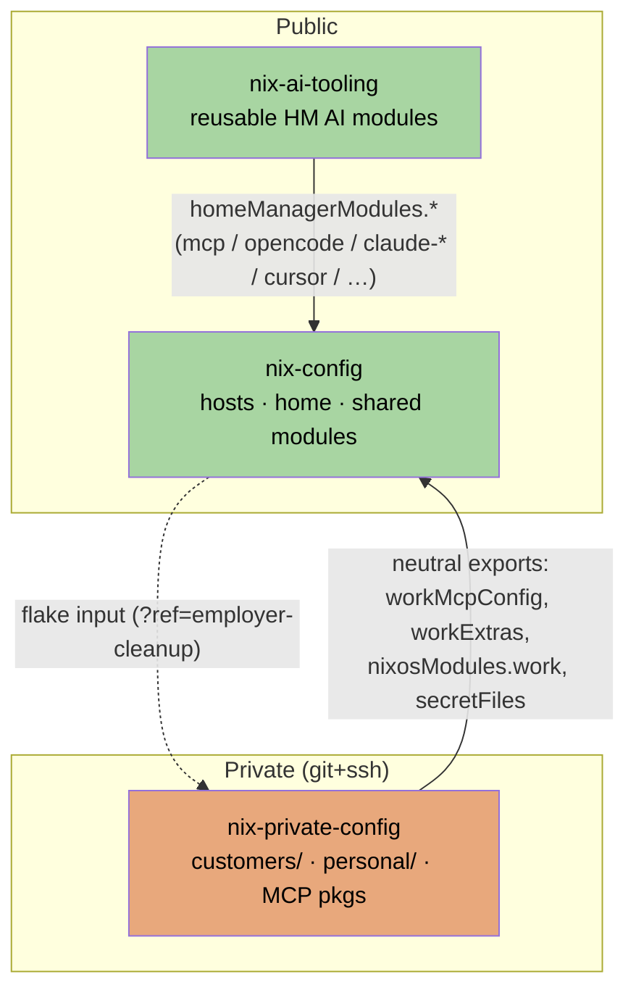
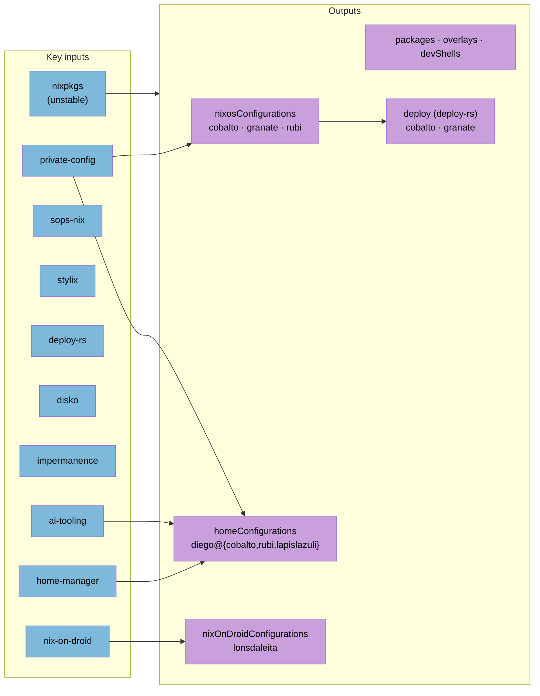
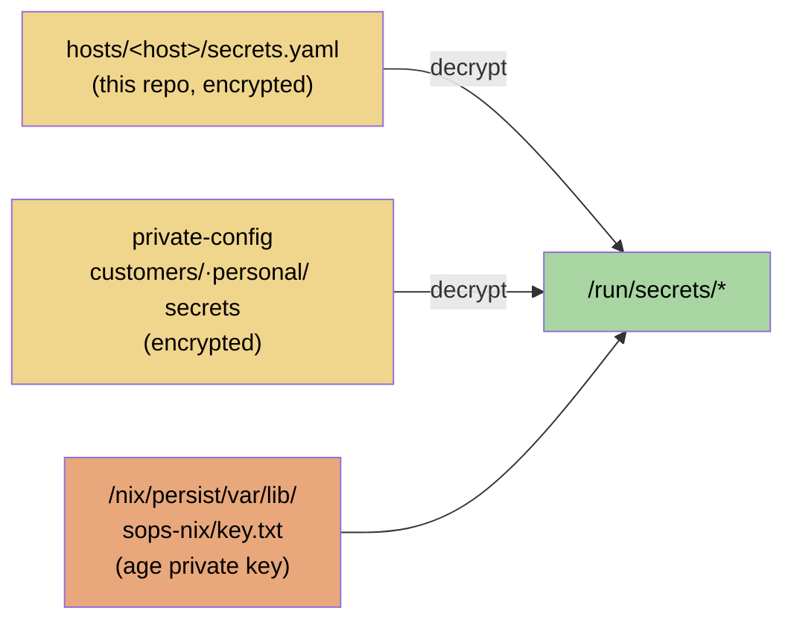

# Architecture

This configuration is split across three repositories. The rule of the split:

> **nix-config**: anything a stranger may read; **nix-ai-tooling**: anything a
> stranger may reuse; **nix-private-config**: anything that names a customer or
> holds a secret.

## The three repositories

| Repo | Visibility | Contents |
| --- | --- | --- |
| `nix-config` (this repo) | **public** | Hosts `cobalto`, `granate`, `rubi` (NixOS), `lonsdaleita` (nix-on-droid), `lapislazuli` (home-manager on macOS); shared modules; per-user features |
| [`nix-ai-tooling`](https://github.com/DiegoBarrosA/nix-ai-tooling) | **public** flake (`github:DiegoBarrosA/nix-ai-tooling`) | Seven reusable home-manager AI modules: `mcp-config`, `opencode-config`, `claude-code-config`, `claude-desktop-config`, `cursor-config`, `antigravity-config`, `ai-skills` |
| `nix-private-config` | **private** (`git+ssh`) | `customers/<name>/` (one directory per engagement) plus `personal/` (private but not customer-bound), plus the customer's private MCP-server packages |

## Repo layout (nix-config)

- `flake.nix` — inputs + outputs (see below).
- `lib/` — `mkHost` / `mkHome` helpers that assemble the flake outputs.
- `hosts/common/global` — config shared by every host.
- `hosts/common/optional/{ai,apps,desktop,media,network,system}` — opt-in modules grouped by domain.
- `hosts/common/users/diego` — user-level system config.
- `hosts/{cobalto,granate,rubi,lonsdaleita}` — per-host entry points.
- `modules/{nixos,home-manager}` — custom option-providing modules.
- `home/diego/features/{ai,cli,desktop}` — per-user feature toggles; `home/diego/<host>.nix` — per-host home entry points.
- `pkgs/`, `overlays/` — custom packages and nixpkgs overlays.
- `docs/` — Jekyll site published to GitHub Pages.

## Flake inputs & outputs

`mkHost system hostname { desktop ? null }` builds a `nixosConfigurations` entry;
`mkHome system entrypoint extraModules { desktop ? null }` builds a
`homeConfigurations` entry, threading `private-config` in as `privateConfig` and
importing `workMcpConfig`. Most sibling inputs (`home-manager`, `sops-nix`,
`disko`, `deploy-rs`, …) `follow` nixpkgs so the whole tree stays on one
revision.

## The customer contract

Each `customers/<name>/default.nix` in the private repo implements one contract:
`nixosModule`, `homeModules.{mcpConfig,claudeDesktopMcpConfig,omnistation}`,
`workProfile`, `opencodeConfig`, `openclawConfig`, `skills`, `secretEnv`,
`secretFiles`, `providerLabel`, `providerId`, `inferenceEnvVar`.

The private flake selects one customer via its `activeCustomer` knob and
re-exports everything under **neutral names** — the only names this repo is
allowed to reference: `homeManagerModules.{workMcpConfig,workClaudeDesktopMcpConfig,workExtras}`,
`nixosModules.work`, `workProfile`, `workSecretEnv`, `workSkills`,
`workProviderLabel`, `workProviderId`, `workInferenceEnvVar`, `secretFiles`,
`opencodeConfig`, `openclawConfig`. This repo therefore contains no
customer-named literals; everything customer-specific flows in through the
`private-config` flake input.

> Runtime env-var names and `/run/secrets/*` paths for work MCP instances are
> deliberately neutral too (`WORK_JIRA_A_*`, `WORK_CONFLUENCE_A_*`,
> `/run/secrets/work-jira-a-*`). The private repo maps these back to the real
> encrypted yaml keys via a sops-nix `key` alias, so no employer-internal
> instance codenames appear here.

## Secrets

Secrets are sops-encrypted (age) and split across two tiers:

- **Host/system secrets** live *in this repo* at `hosts/<host>/secrets.yaml`
  (encrypted). They cover system-level material (`diego-password`,
  `tailscale-key`, `luks-passphrase`, …). Base wiring is in
  `hosts/common/optional/system/sops-base.nix`, which sets
  `defaultSopsFile = hosts/<hostname>/secrets.yaml` and decrypts with a **static
  age key** at `/nix/persist/var/lib/sops-nix/key.txt` (`age.generateKey = false`).
- **Work & personal secrets** live *only in the private repo*, under
  `customers/<name>/secrets/` and `personal/secrets/`, and reach this repo
  through `private-config`'s `secretFiles` export.

A plaintext `hosts/rubi/secrets.yaml.template` documents the required keys for a
fresh install; only the encrypted `secrets.yaml` is ever meant to be committed
(enforced by `.gitignore`).

## New engagement checklist

1. Create `customers/<name>/` in the private repo implementing the contract above.
2. Flip `activeCustomer = "<name>";` in the private repo's `flake.nix`.
3. Add sops-encrypted secrets under `customers/<name>/secrets/`.
4. In this repo: `nix flake lock --update-input private-config`.

## CI/CD

GitHub Actions workflows in `.github/workflows/`:

- `coderabbit-review.yml` — AI code review (CodeRabbit) on pull requests.
- `jekyll.yml` — builds & publishes the `docs/` site to GitHub Pages.
- `build-iso.yml` — builds a NixOS installer ISO.

Remote deployment is handled out-of-band by **deploy-rs** (`nix run .#deploy`),
which targets `cobalto` (over Tailscale) and `granate` (over its public IP).

## TEMP

The `private-config` input is currently pinned to the private repo's cleanup
branch (`?ref=employer-cleanup` in `flake.nix`). Drop the ref when the cleanup
branches merge to their default branches.
