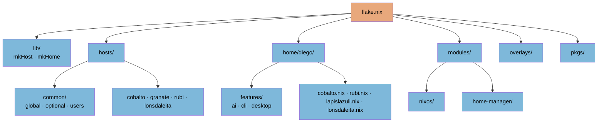

This document explains the file and directory structure of this NixOS
configuration repository. For the higher-level design (the three-repository
split, the customer contract, secrets tiers), see
[`ARCHITECTURE.md`](https://github.com/DiegoBarrosA/nix-config/blob/main/ARCHITECTURE.md).

## Root

- `flake.nix`: The entry point. Declares inputs, outputs,
  `nixosConfigurations`, `homeConfigurations`, `nixOnDroidConfigurations`,
  `deploy` (deploy-rs), and the packages/overlays outputs.
- `default.nix`, `shell.nix`: Non-flake entry and dev shell (`nix-shell`).
- `probe.nix`: Small helper for evaluating/inspecting the config.
- `ARCHITECTURE.md`: High-level design overview.
- `README.md`: Project intro; points at the docs site.

_(There is no `iso.nix`, `keys/`, or `scripts/` directory — an installer ISO is
built by the `build-iso` GitHub Actions workflow instead.)_

## `lib/`

`mkHost` and `mkHome` helpers that turn a host name + entry point into the
corresponding flake output (`default.nix`).

## `hosts/`

NixOS (and nix-on-droid) configuration per machine.

- `common/global/`: Imported by every host.
- `common/optional/{ai,apps,desktop,media,network,system}/`: Opt-in modules,
  grouped by domain, that a host imports as needed. SOPS base wiring lives in
  `common/optional/system/`.
- `common/users/diego/`: User-level system config.
- `cobalto/`, `granate/`, `rubi/`, `lonsdaleita/`: Per-host entry points. Each
  encrypted `secrets.yaml` lives beside its host.

## `home/`

Home Manager configuration.

- `diego/features/`: Modular user features (`ai`, `cli`, `desktop`).
- `diego/global/`: User-wide defaults.
- `diego/<host>.nix`: Per-host home entry points (`cobalto.nix`, `rubi.nix`,
  `lapislazuli.nix`, `lonsdaleita.nix`).

## `modules/`

Custom option-providing modules, split into `nixos/` and `home-manager/`.

## `overlays/`

Nixpkgs overlays for customizing or pinning packages.

## `pkgs/`

Custom packages not in Nixpkgs (exposed via the flake's `packages` output).

## `docs/`

This documentation, built with Jekyll and published to GitHub Pages
(`_config.yml`, `_layouts/`).
